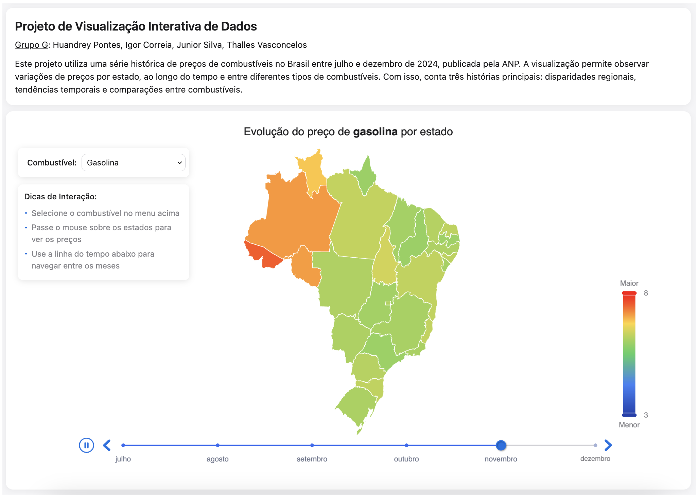

# Visualização de Preços de Combustíveis no Brasil

Este projeto apresenta uma visualização interativa dos preços de combustíveis no Brasil entre julho e dezembro de 2024, utilizando dados da ANP (Agência Nacional do Petróleo).

## Funcionalidades

- Visualização de preços por estado em um mapa do Brasil
- Seleção de diferentes tipos de combustíveis (Gasolina, Etanol, Diesel, etc.)
- Navegação temporal através de uma linha do tempo
- Exibição de variações de preços através de um gradiente de cores
- Tooltips informativos ao passar o mouse sobre os estados

## Exemplo

## Como Usar

1. Selecione o combustível desejado no menu dropdown
2. Passe o mouse sobre os estados para ver os preços específicos
3. Use a linha do tempo para navegar entre os meses
4. Observe o gradiente de cores para identificar variações de preços

## Grupo G

- Huandrey Pontes
- Igor Correia
- Junior Silva
- Thalles Vasconcelos

## Dados

Os dados utilizados neste projeto são provenientes da ANP e cobrem o período de julho a dezembro de 2024, permitindo observar disparidades regionais, tendências temporais e comparações entre diferentes tipos de combustíveis.